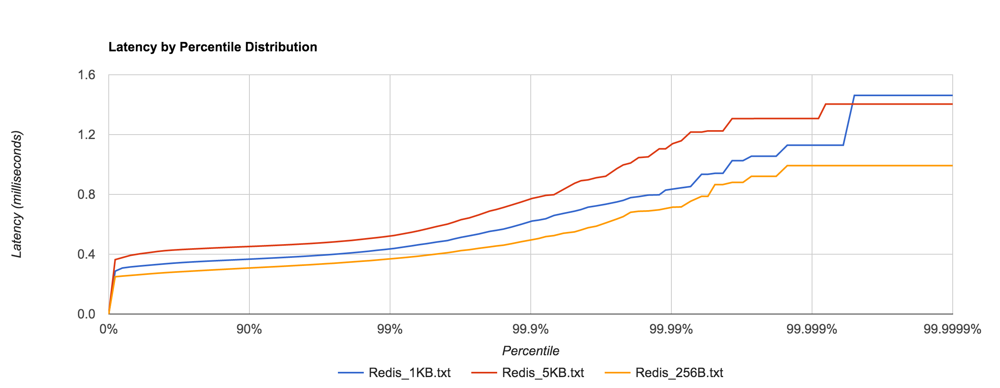

# nats-experiments
A docker environment to run a nats server and some clients

## Compliance Checklist

- [ ] Mercury
- [x] Venus
- [x] Earth (Orbit/Moon)
- [x] Mars
- [ ] Jupiter
- [ ] Saturn
- [ ] Uranus
- [ ] Neptune
- [ ] Comet Haley

## NATS Performance

This article give some insigts to NATS performance with a comparison to REDIS.

